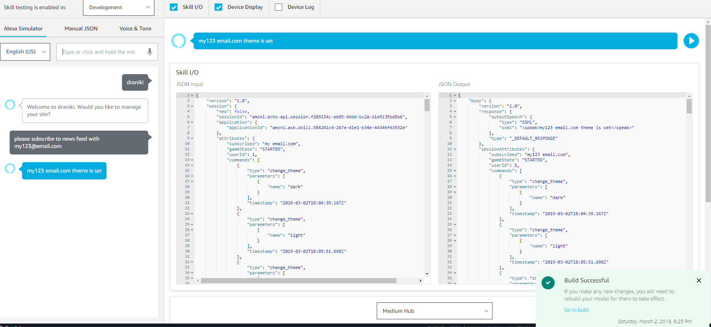

## Summary

**Category:** Enhancement to JSS to change a JSS component rendering behavior based on user's session data.

The module aims to bring user experience of the Sitecore website to the new level. 
Using verbal communication channel with Alexa application the components on the website can reflect the requests of the user and change there presentation together with behaviour.
The module presents just a small bit of what can be done through the voice operations: potential is to have commerce experience on the website using just verbal communication - review and buy products, view articles, play videos and ets.

## Module Architecture


## Pre-requisites

* VirtualBox 5.2.4+ - https://www.virtualbox.org/wiki/Downloads
* VirtualBox Extension Pack
* Vagrant 2.0.1+ - https://www.vagrantup.com/downloads.html
* Vagrant plugin vagrant-hostmanager
    ```vagrant plugin install vagrant-hostmanager```
* Visual Studio 2017 Professional
* Resharper
* StyleCop for ReSharper - https://github.com/StyleCop/StyleCop.ReSharper
* NodeJS 8+/npm 5+ - https://nodejs.org/en/

### Installation

1. Run `vagrant up` under the *(gitroot)* folder with administrator privileges. It will download the box image and configure the enviroment.
1. Install Sitecore JavaScript Services package - https://jss.sitecore.net/#/setup/jss-server-install?id=jss-server-install
1. Install Node.JS
1. Open shared folder (`\\sc9.local\c$\`) with file explorer and save credentials. You can check them in Control Panel\User Accounts\Credential Manager under Windows Credentials tab.
*Creds*: vagrant/vagrant
1. Copy Sitecore licence to *(gitroot)* folder
1. Run `./build.ps1` in PowerShell with administrator privileges. It is required only for first time to download cake. The next deployments can be done from Visual Studio.
1. Republish Sitecore content (Unicorn should publish synced data but in case of any issues better to republish).

## Configuration

How do you configure your module once it is installed? Are there items that need to be updated with settings, or maybe config files need to have keys updated?

Remember you are using Markdown, you can provide code samples too:

```xml
<?xml version="1.0"?>
<!--
  Purpose: Configuration settings for my hackathon module
-->
<configuration xmlns:patch="http://www.sitecore.net/xmlconfig/">
  <sitecore>
    <settings>
      <setting name="MyModule.Setting" value="Hackathon" />
    </settings>
  </sitecore>
</configuration>
```

 - Additional configuration of the AWS (Amazon Web Services) should be done to complete installation. The file with credentials for Amazon API must be put into folder C:\hackathon in file named credentials
 The content of the file:
 
[{profile_name}]
aws_access_key_id = {accessKey}
aws_secret_access_key = {secretKey}

{profile_name} - development
{accessKey} - Amazon Account access key
{secretKey} - Amazon Account secret key

## Alexa skill dev 

### Commands

- change theme to {dark|light}
- please subscribe to news feed with {my@email.com}


### Pre-requisites

* Node.js (> v8)
* Register for an [AWS Account](https://aws.amazon.com/)
* Register for an [Amazon Developer Account](https://developer.amazon.com?&sc_category=Owned&sc_channel=RD&sc_campaign=Evangelism2018&sc_publisher=github&sc_content=Content&sc_detail=high-low-game-nodejs-V2_CLI-1&sc_funnel=Convert&sc_country=WW&sc_medium=Owned_RD_Evangelism2018_github_Content_high-low-game-nodejs-V2_CLI-1_Convert_WW_beginnersdevs&sc_segment=beginnersdevs)
* Install and Setup [ASK CLI](https://developer.amazon.com/docs/smapi/quick-start-alexa-skills-kit-command-line-interface.html?&sc_category=Owned&sc_channel=RD&sc_campaign=Evangelism2018&sc_publisher=github&sc_content=Content&sc_detail=high-low-game-nodejs-V2_CLI-1&sc_funnel=Convert&sc_country=WW&sc_medium=Owned_RD_Evangelism2018_github_Content_high-low-game-nodejs-V2_CLI-1_Convert_WW_beginnersdevs&sc_segment=beginnersdevs)

### Installation
 **Make sure** you are running the latest version of the CLI

	```bash
	npm update -g ask-cli
	```


### Deployment

ASK CLI **will create the skill and the lambda function for you**. The Lambda function will be created in ```us-east-1 (Northern Virginia)``` by default.

1. Navigate to the project's root directory. you should see a file named 'skill.json' there.
1. Deploy the skill and the lambda function in one step by running the following command:
	```bash
	ask deploy
	```
1. Once deployed, additional permissions need to be added to the AWS IAM role being used by the function since it is persisting data in Amazon DynamoDB. Locate the execution role used by the skill's Lambda function in the AWS IAM Console.
    1. Open the AWS Console: https://console.aws.amazon.com/iam
    1. Click on **Roles**.
    1. Type (at least part of) the name of your skill in the search box. (Replace spaces with dashes.)
    1. Click the role that corresponds to your skill's function.
		> Note: If you can't find the correct role, first locate your skill's function in [AWS Lambda](https://console.aws.amazon.com/lambda). Scroll down to the section labeled **Execution Role** and find the role name there.
1. On the right side of the **Permissions** tab, click **+ Add inline policy**.
1. Click the **JSON** tab.
1. Select the existing JSON and replace it with the following policy document.  This policy grants access to the role to (1) create the needed table and (2) read/write items to the table.  It is restricted to this for just a table named 'Draniki'.
    ```
    {
        "Version": "2012-10-17",
        "Statement": [
            {
                "Sid": "DynamoDBTableCreationAndAccess",
                "Effect": "Allow",
                "Action": [
                    "dynamodb:CreateTable",
                    "dynamodb:PutItem",
                    "dynamodb:GetItem",
                    "dynamodb:UpdateItem"
                ],
                "Resource": "arn:aws:dynamodb:*:*:table/draniki-commands-table"
            }
        ]
    }
    ```
		> Note: The table name as specified in the sample code is `draniki`.  If you want to use a different name, change it in the policy and in the sample code.  The name doesn't matter as long as they match.
1. Click **Review Policy**.
1. Enter `DynamoDBTableAccess` as the **Name**.
1. Click **Create Policy**.

### Testing

1. To test, you need to login to Alexa Developer Console, and **enable the "Test" switch on your skill from the "Test" Tab**.

2. Simulate verbal interaction with your skill through the command line (this might take a few moments) using the following example:

	```bash
	 ask simulate -l en-GB -t "draniki"

	 ✓ Simulation created for simulation id: 4a7a9ed8-94b2-40c0-b3bd-fb63d9887fa7
	◡ Waiting for simulation response{
	  "status": "SUCCESSFUL",
	  ...
	 ```

3. Once the "Test" switch is enabled, your skill can be tested on devices associated with the developer account as well. Speak to Alexa from any enabled device, from your browser at [echosim.io](https://echosim.io/welcome), or through your Amazon Mobile App and say :

	```text
	Alexa, start draniki
	```
## Customization

1. ```./skill.json```

   Change the skill name, example phrase, icons, testing instructions etc ...

   Remember than many information are locale-specific and must be changed for each locale (en-GB and en-US)


2. ```./lambda/custom/index.js```

   Modify messages, and data from the source code to customize the skill.

3. ```./models/*.json```

	Change the model definition to replace the invocation name and the sample phrase for each intent.  Repeat the operation for each locale you are planning to support.

4. Remember to re-deploy your skill and lambda function for your changes to take effect.

## Usage

### Alexa simulator


### WebSite with dark theme


### WebSite with light theme


### Dialog with email


## Video

Please provide a video highlighing your Hackathon module submission and provide a link to the video. Either a [direct link](https://www.youtube.com/watch?v=EpNhxW4pNKk) to the video, upload it to this documentation folder or maybe upload it to Youtube...

[direct link](https://drive.google.com/file/d/1DybQrrYgyLHssk7wCSCCsH2Y5-AkYlFF/view?usp=sharing)
